# NimbleLamp - Interactive Smart Lamp System


## Overview

.png)

NimbleLamp Advance is an evolution of the original Bookworm Annoying Lamp concept By RoAnWo in instructables, featuring significant hardware improvements and enhanced functionality. This ESP32-based system implements a stepper motor mechanism with silent drivers, precise time-of-flight sensing, and multiple control modes. The lamp intelligently responds to user presence while providing customizable interaction modes.

## Key Features
- **Adaptive Movement System**: Uses TMC2209 silent stepper drivers for smooth, quiet operation
- **Precision Sensing**: VL53L0X time-of-flight sensor for accurate hand detection
- **Dual Control Modes**: 
  - Annoying Mode: Lamp moves away when approached
  - Normal Mode: Lamp turns off when approached
- **Multiple Activation Methods**:
  - Physical button mode toggle
  - Capacitive touch control
- **Modular Design**: Separated hardware/firmware architecture for easy customization

## Hardware Architecture

```mermaid
graph LR
    ESP32[ESP32 Controller] -->|UART| TMC2209[TMC2209 Driver]
    ESP32 -->|I²C| VL53L0X[Distance Sensor]
    TMC2209 --> NEMA17[Stepper Motor]
    ESP32 --> MOSFET[LED Control]
    ESP32 --> BUTTON[Mode Button]
    ESP32 --> TOUCH[Touch Sensor]
```

## Wiring


## Getting Started

### Prerequisites
- PlatformIO IDE (VSCode extension recommended)
- ESP32 development board
- TMC2209-compatible stepper driver
- VL53L0X time-of-flight sensor

### Installation
1. Clone repository:
   ```bash
   git clone https://github.com/Customize5773/NimbleLamp_Interactive_Lamp.git
   ```
2. Install dependencies:
   ```bash
   pio lib install "adafruit/Adafruit VL53L0X"
   pio lib install "teemuatlut/TMCStepper"
   ```
3. Build and upload:
   ```bash
   pio run -t upload
   ```

### Configuration
Modify `config.h` for hardware-specific settings:
```cpp
// Stepper parameters
const uint16_t MAX_SPEED = 1200;    // steps/s
const int32_t MOVE_DISTANCE = 300;  // escape distance

// Sensor thresholds
const uint16_t DETECT_DISTANCE = 80;   // detection range (mm)
```

## Usage Examples
1. **Basic Operation**:
   - Power on the lamp
   - Press button to toggle modes
   - Approach hand to trigger response

2. **Advanced Control**:
   - Touch copper pad to switch modes
   - Calibrate sensor range via serial monitor
   - Adjust movement parameters in firmware

3. **Serial Monitoring**:
   ```bash
   pio device monitor
   ```
   Output shows sensor readings and mode status:
   ```
   Distance: 142mm | Mode: ANNOYING
   Hand detected! Triggering escape sequence...
   ```

## Hardware Integration
For mechanical assembly:
1. Mount stepper motor on base plate
2. Attach pulley to motor shaft
3. Install linear rail system
4. Position sensor facing detection area
5. Secure lamp housing with LED strip

Refer to [assembly guide](docs/assembly_guide.md) for detailed instructions.

## Contributing
Contributions are welcome. Please follow these steps:
1. Fork the repository
2. Create a feature branch (`git checkout -b feature/improvement`)
3. Commit changes (`git commit -am 'Add new feature'`)
4. Push to branch (`git push origin feature/improvement`)
5. Open a pull request

## License
Distributed under the MIT License. See `LICENSE` for more information.

## Support
For technical assistance, open an issue on GitHub or consult the [troubleshooting guide](docs/troubleshooting.md).
