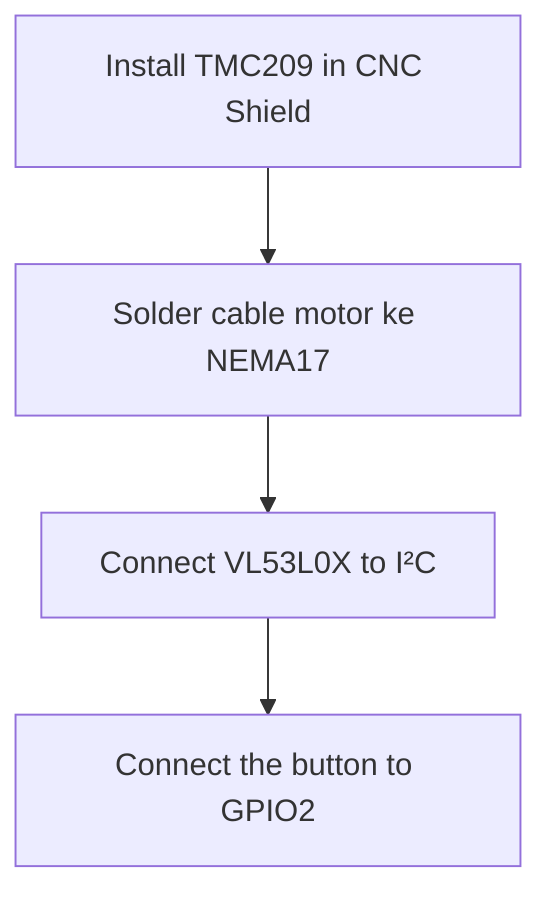

# NimbleLamp Advance Assembly Guide

## Main Components
1. ESP32 DevKit board
2. TMC2209 Stepper Driver
3. NEMA17 Stepper Motor
4. VL53L0X Proximity Sensor
5. Buck converter module LM2596
6. LED Strip 12V + MOSFET
7. Mode Button
8. 3D Casing (Base, Arm, Lamp Housing)

## Assembly Steps

### 1. Electronics Preparation



### 2. Power Supply
- 12V input → Buck Converter
- 5V output → ESP32 and TMC2209
- VMOT 12V → TMC2209
- Add a parallel 100µF capacitor at VMOT

### 3. Mechanical Mounting
1. Fasten the NEMA17 to the base plate
2. Attach the GT2 pulley to the motor shaft
3. Attach the linear rail to the base
4. Connect the carriage to the GT2 belt

### 4. Wiring Final
| Component | Target Pin |
|----------|------------|
| TMC STEP | GPIO14     |
| TMC DIR  | GPIO27     |
| VL53L0X  | GPIO21/22  |
| LED Strip| GPIO5      |

### 5. Sensor & Light Installation
1. Attach the VL53L0X to the front of the light housing.
2. Attach the LED strip inside the diffuser.
3. Install the copper touch pad on the casing.

### 6. Initial Testing

```ino
// Simple test code
void setup() {
  Serial.begin(115200);
  pinMode(2, INPUT_PULLUP);
  Serial.println("Button Test: Press button");
}

void loop() {
  if(digitalRead(2) == LOW) {
    Serial.println("Button Works!");
    delay(300);
  }
}
```

## Assembly Diagram

