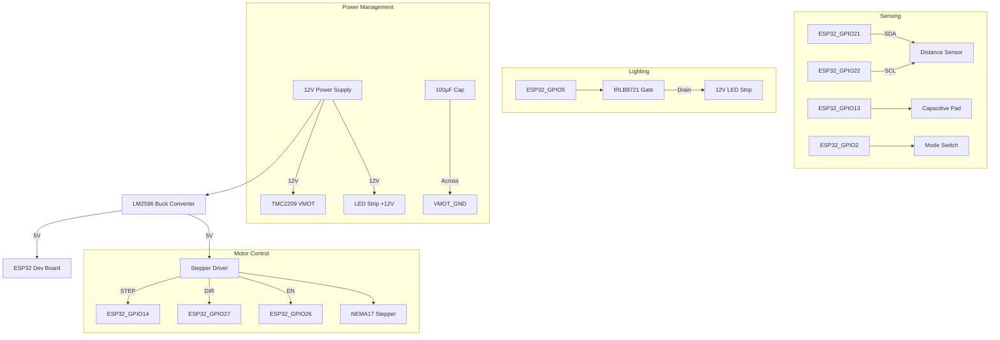

# Circuit Architecture - Signal Flow  



## Key Connection Details  

### Power Distribution  
```  
12V Input  
├── Buck Converter (12V→5V)  
│   ├── ESP32 Vin  
│   ├── TMC2209 VIO  
│   └── VL53L0X VCC  
├── TMC2209 VMOT (with 100µF cap)  
└── LED Strip +12V  
```  

### GPIO Mapping  
| Function | ESP32 Pin | Connected To |  
|----------|-----------|-------------|  
| Stepper STEP | GPIO14 | TMC2209 STEP |  
| Stepper DIR | GPIO27 | TMC2209 DIR |  
| Stepper ENABLE | GPIO26 | TMC2209 EN |  
| I²C SDA | GPIO21 | VL53L0X SDA |  
| I²C SCL | GPIO22 | VL53L0X SCL |  
| Touch Sensor | GPIO13 | Copper Pad |  
| Mode Button | GPIO2 | Tactile Switch |  
| LED Control | GPIO5 | MOSFET Gate |  

### Protection Measures  
1. **Motor Noise Suppression:**  
   - 100µF electrolytic capacitor between VMOT and GND  
   - 0.1µF ceramic capacitor across motor coils  
2. **Logic Level Safety:**  
   - 330Ω resistor on all ESP32 signal lines  
   - TVS diodes on I²C lines  
3. **ESD Protection:**  
   - 1MΩ resistor on touch sensor line  

## Design Notes  
- Keep motor power wiring separate from logic signals  
- Use twisted pairs for stepper motor connections  
- Maintain <5cm wire length for VL53L0X I²C lines  
- MOSFET requires heatsink for >1A LED loads

## Wiring


