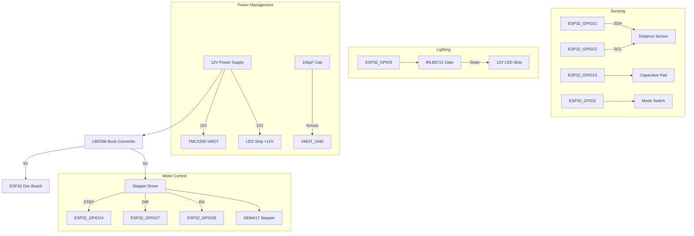

# Circuit Architecture - Signal Flow  

```mermaid  
flowchart TD  
    PSU[12V Power Supply] --> BUCK[LM2596 Buck Converter]  
    BUCK -->|5V| ESP32[ESP32 Dev Board]  
    BUCK -->|5V| TMC2209[Stepper Driver]  
    
    subgraph Motor Control  
        TMC2209 -->|STEP| ESP32_GPIO14  
        TMC2209 -->|DIR| ESP32_GPIO27  
        TMC2209 -->|EN| ESP32_GPIO26  
        TMC2209 --> MOTOR[NEMA17 Stepper]  
    end  

    subgraph Sensing  
        ESP32_GPIO21 -->|SDA| VL53L0X[Distance Sensor]  
        ESP32_GPIO22 -->|SCL| VL53L0X  
        ESP32_GPIO13 --> TOUCH[Capacitive Pad]  
        ESP32_GPIO2 --> BUTTON[Mode Switch]  
    end  

    subgraph Lighting  
        ESP32_GPIO5 --> MOSFET[IRLB8721 Gate]  
        MOSFET -->|Drain| LED_STRIP[12V LED Strip]  
    end  

    subgraph Power Management  
        PSU -->|12V| VMOT[TMC2209 VMOT]  
        PSU -->|12V| VLED[LED Strip +12V]  
        CAP[100µF Cap] -->|Across| VMOT_GND  
    end
```
